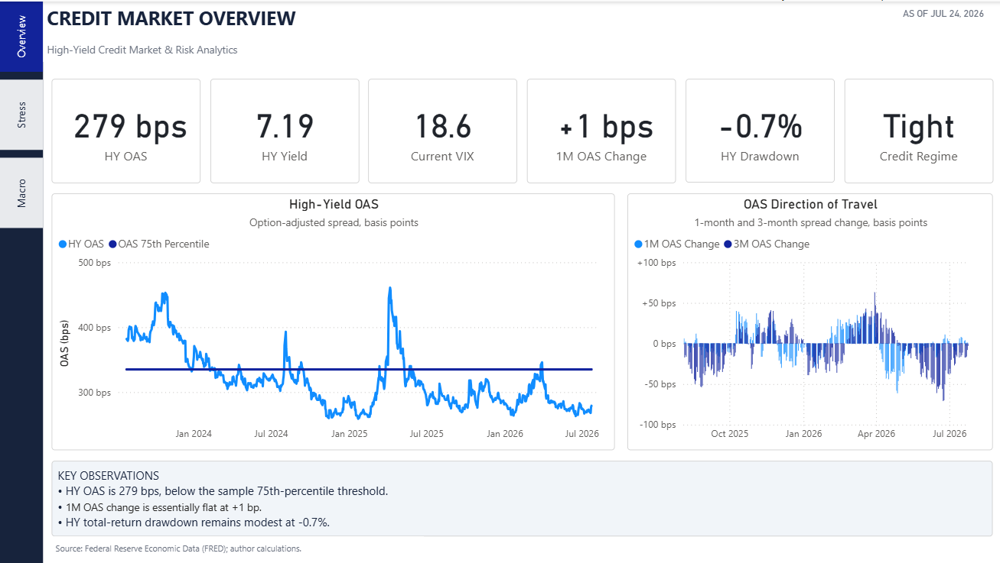
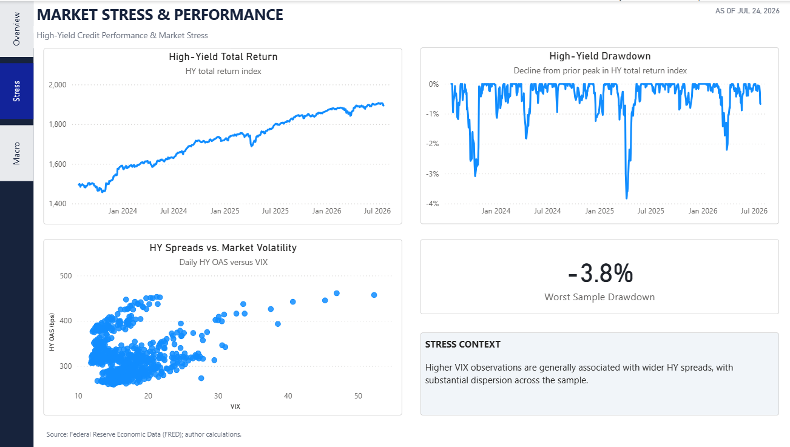
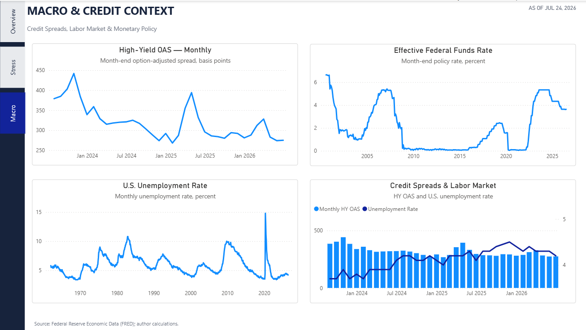
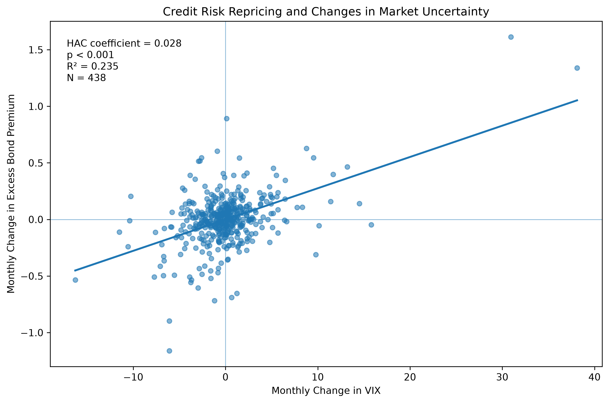
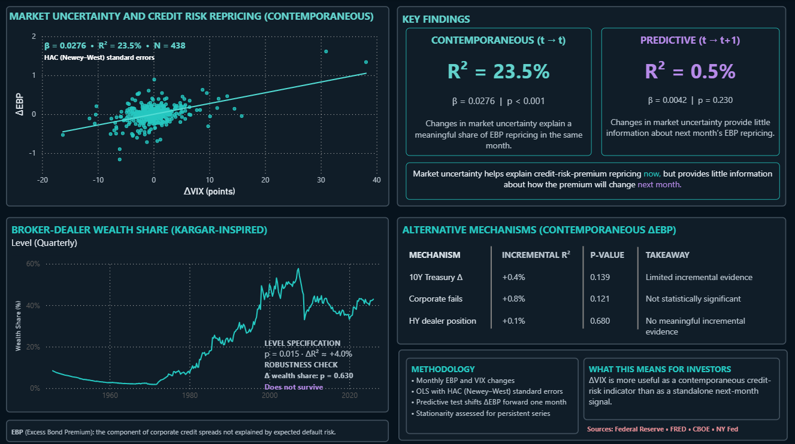

# High-Yield Credit Analytics

A credit-market analytics project for monitoring U.S. high-yield credit conditions, spread behavior, market stress, and macroeconomic context.

The project combines a reproducible Python/FRED data pipeline with derived credit-risk metrics and a three-page Power BI monitoring dashboard.

## Dashboard

### Credit Market Overview



Tracks current high-yield credit conditions through option-adjusted spreads (OAS), yield, volatility, spread momentum, total-return drawdown, and a rules-based credit regime indicator.

### Market Stress & Performance



Examines high-yield total-return performance, drawdowns, and the relationship between market volatility and HY credit spreads.

### Macro & Credit Context



Places recent credit conditions within a broader macroeconomic context using monthly HY spreads, the effective federal funds rate, and U.S. unemployment.

## Analytical Framework

The project focuses on several dimensions of high-yield credit risk:

- **Spread level:** current HY option-adjusted spread and its position within the available sample distribution
- **Spread momentum:** 1-month and 3-month changes in OAS
- **Credit regime:** rules-based classification of spread conditions
- **Market stress:** VIX and the relationship between volatility and HY spreads
- **Performance risk:** high-yield total-return index behavior and drawdown
- **Macro context:** monetary-policy and labor-market conditions

Percentile statistics and regime classifications are interpreted relative to the available project sample rather than as full-cycle historical estimates.

## Data

Primary market and macroeconomic series are sourced from the Federal Reserve Economic Data (FRED) database.

The pipeline integrates daily and monthly series covering:

- U.S. high-yield option-adjusted spreads
- U.S. high-yield effective yield
- high-yield total-return performance
- CBOE VIX
- Effective Federal Funds Rate
- U.S. unemployment rate

Raw source data can be regenerated using the download scripts and is therefore excluded from version control.

## Methodology

Python scripts handle data retrieval, cleaning, alignment, and construction of derived analytical fields used by the dashboard.

Derived measures include:

- OAS expressed in basis points
- 1-month and 3-month spread changes
- sample OAS percentile
- rules-based credit regime
- high-yield total-return drawdown
- spread widening and tightening diagnostics

Power BI is used for the presentation layer, including DAX measures, current-condition KPIs, historical visualizations, and cross-filtering between market observations and dashboard metrics.

## Repository Structure

```text
high-yield-credit-analytics/
├── data/
│   └── processed/        # Clean analytical datasets
├── images/               # Dashboard screenshots
├── powerbi/              # Power BI report
├── reports/              # Research/report outputs
├── src/                  # Data pipeline and analytical scripts
├── .gitignore
├── README.md
└── requirements.txt
```

## Technology

**Python** · **pandas** · **FRED API** · **Power BI** · **DAX** · **Git/GitHub**

## Version 2 — Excess Bond Premium Dynamics

Version 2 extends the project from the market-level high-yield spread analysis in V1 to the dynamics of the **Excess Bond Premium (EBP)**.

Where V1 focuses primarily on high-yield option-adjusted spreads (OAS), market stress, performance, and macroeconomic context, V2 asks a narrower research question:

> **What explains changes in the credit risk premium, and do variables associated with current repricing also contain information about future repricing?**

The analysis uses monthly changes in the Excess Bond Premium (ΔEBP) and VIX (ΔVIX) to focus on credit-risk-premium repricing rather than persistent levels.

### Main Result

The contemporaneous specification,

`ΔEBP_t ~ ΔVIX_t`

produces:

- **N = 438**
- **ΔVIX coefficient = 0.0276**
- **R² = 23.5%**
- **p < 0.001**

Changes in market uncertainty therefore explain a meaningful share of contemporaneous EBP repricing.



The predictive specification tells a very different story:

`ΔEBP_(t+1) ~ ΔVIX_t`

with **R² = 0.5%** and **p = 0.230**. In this specification, changes in VIX contain little information about EBP repricing one month ahead.

The distinction is important: a variable can help explain **current repricing** without providing a useful **forward signal**.

### Robustness and Alternative Mechanisms

Additional tests using changes in the 10-year Treasury yield, corporate settlement fails, and high-yield dealer net positions provide little incremental explanatory power beyond ΔVIX.

A Kargar-inspired intermediary-capacity experiment initially produces a statistically significant relationship between broker-dealer wealth share and future ΔEBP in levels. However, broker-dealer wealth share is highly persistent, and the relationship does not survive a first-difference robustness specification.

The result is therefore treated as **suggestive but not robust evidence**, rather than as a validated predictive relationship.

### Power BI Research Extension

V2 adds a fourth page, **EBP Dynamics**, to the existing Power BI report. The page summarizes the contemporaneous-versus-predictive result, intermediary-capacity robustness test, and supporting mechanism tests.



## Project Status

**Version 1 complete:** Reproducible market-data pipeline, derived high-yield credit diagnostics, and three-page Power BI dashboard focused on OAS, market stress, performance, and macro context.

**Version 2 complete:** Excess Bond Premium research extension examining contemporaneous repricing, one-month-ahead predictive power, alternative mechanisms, and time-series robustness, with a fourth Power BI page dedicated to EBP dynamics.
